# Online Shopping MERN Stack

Dự án "Online Shopping" là một ứng dụng thương mại điện tử đơn giản được xây dựng theo kiến trúc MERN Stack, kết hợp:
- **MongoDB**: cơ sở dữ liệu NoSQL
- **Express**: backend API
- **React**: frontend cho Admin và Customer
- **Node.js**: môi trường chạy server

## Tổng quan

Dự án gồm 3 phần chính:
- `server/`: backend Express + MongoDB
- `client-admin/`: giao diện quản trị viên (admin)
- `client-customer/`: giao diện khách hàng
- `resources/mongodb/`: dữ liệu mẫu cho MongoDB

## Tính năng chính

### Admin
- Đăng nhập bằng username/password
- Show/hide password và remember me cho trang login
- Quản lý danh mục sản phẩm (CRUD)
- Quản lý sản phẩm (CRUD)
- Xem danh sách đơn hàng
- Cập nhật trạng thái đơn hàng
- Quản lý khách hàng
- Gửi email kích hoạt khách hàng
- Vô hiệu hóa (deactive) khách hàng

### Customer
- Đăng ký tài khoản
- Kích hoạt tài khoản qua email
- Đăng nhập / đăng xuất
- Quên mật khẩu và đặt lại mật khẩu qua email
- Duyệt danh mục và sản phẩm
- Tìm kiếm sản phẩm
- Xem chi tiết sản phẩm
- Thêm giỏ hàng và thanh toán
- Xem đơn hàng của người dùng
- Cập nhật thông tin cá nhân

## Ảnh minh họa chức năng
### Admin
#### Đăng nhập
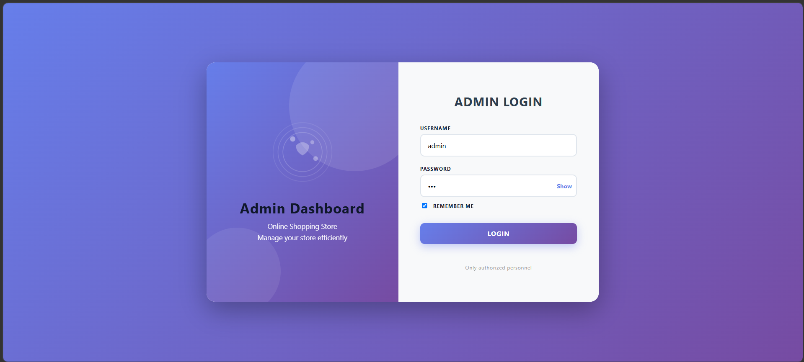

#### Dashboard
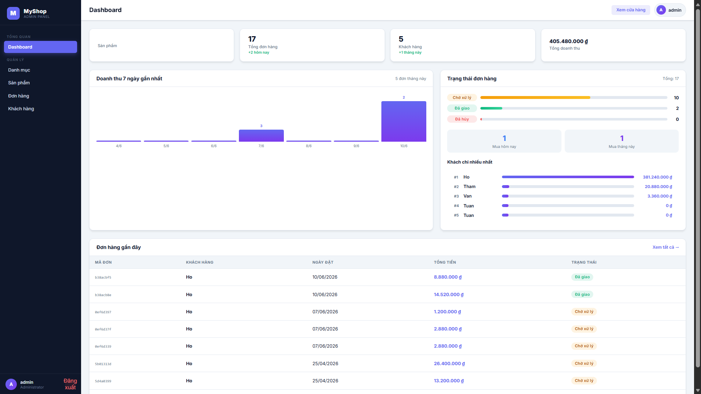

#### Quản lý danh mục
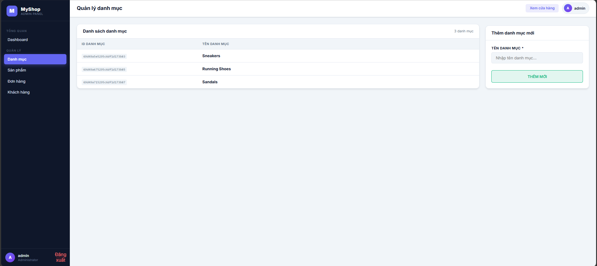

#### Quản lý sản phẩm
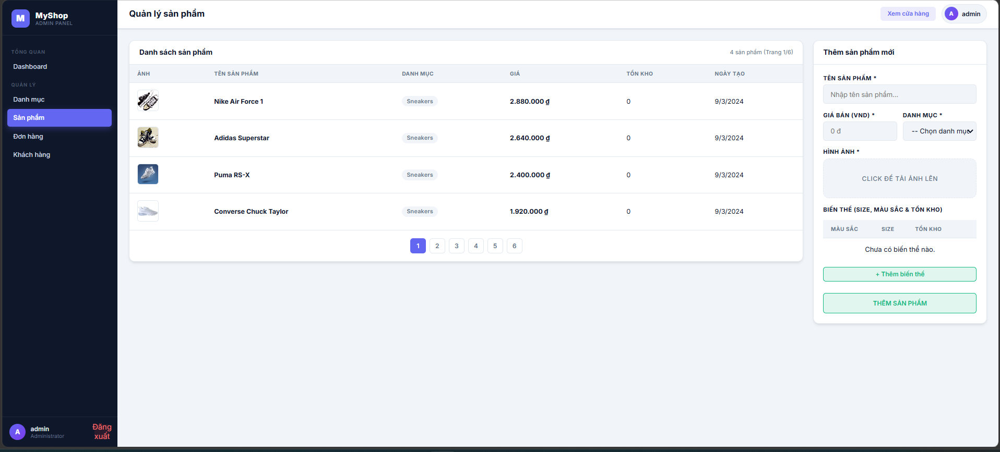

#### Quản lý đơn hàng
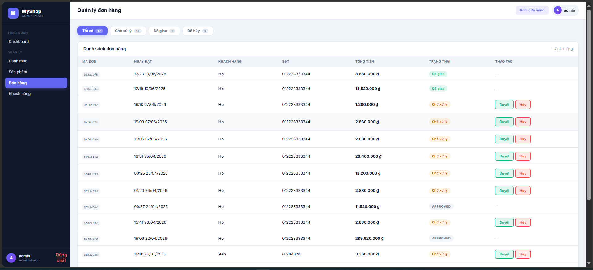

#### Quản lý khách hàng
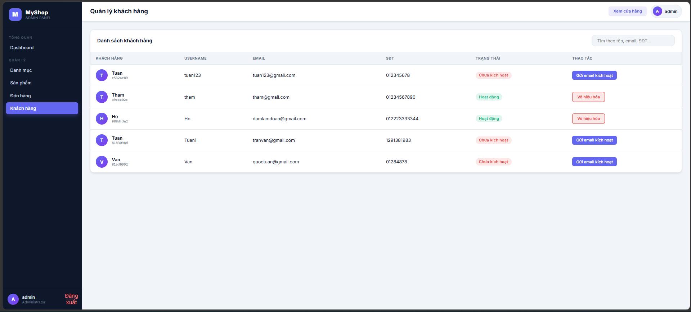

### Customer
#### Đăng nhập
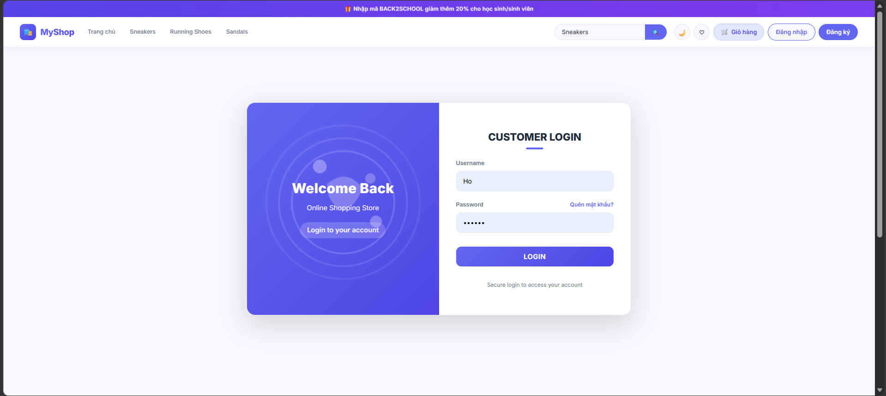

#### Đăng ký


#### Trang chủ / Sản phẩm mới
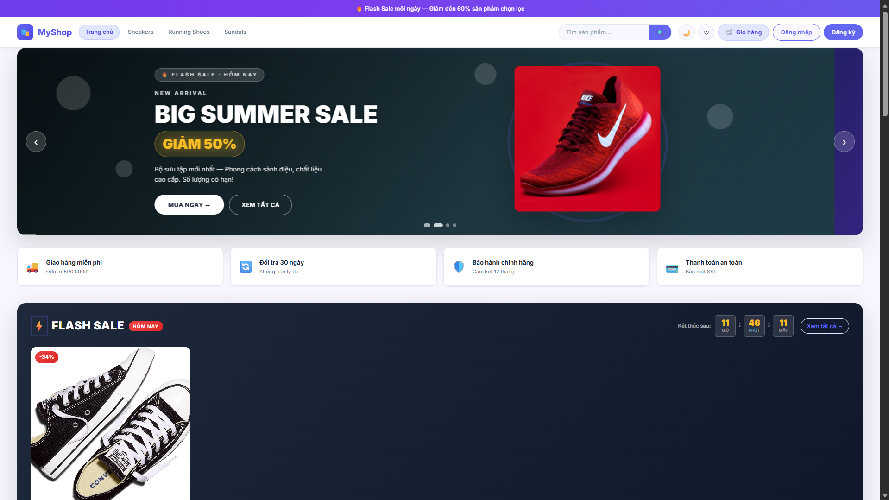

#### Tìm kiếm sản phẩm
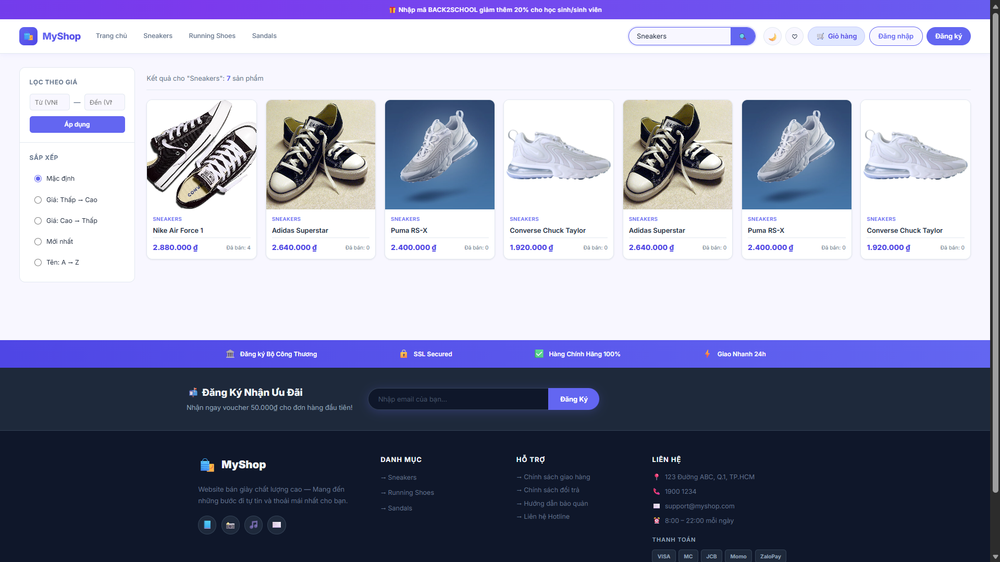

#### Chi tiết sản phẩm
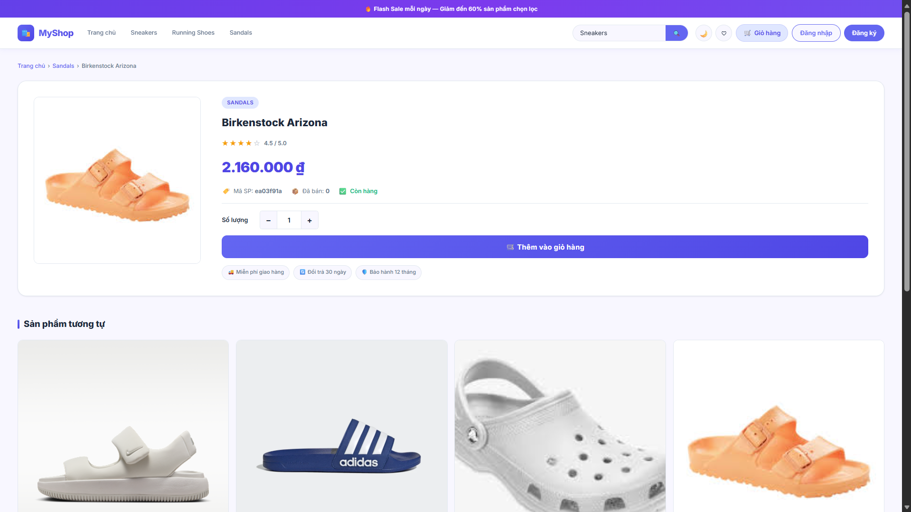

#### Giỏ hàng / Thanh toán
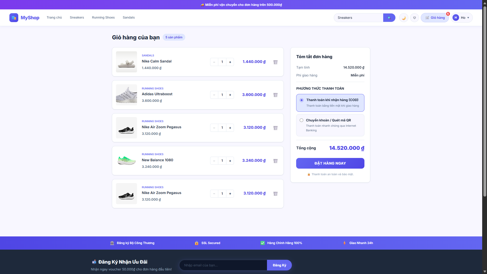

#### Thông tin cá nhân
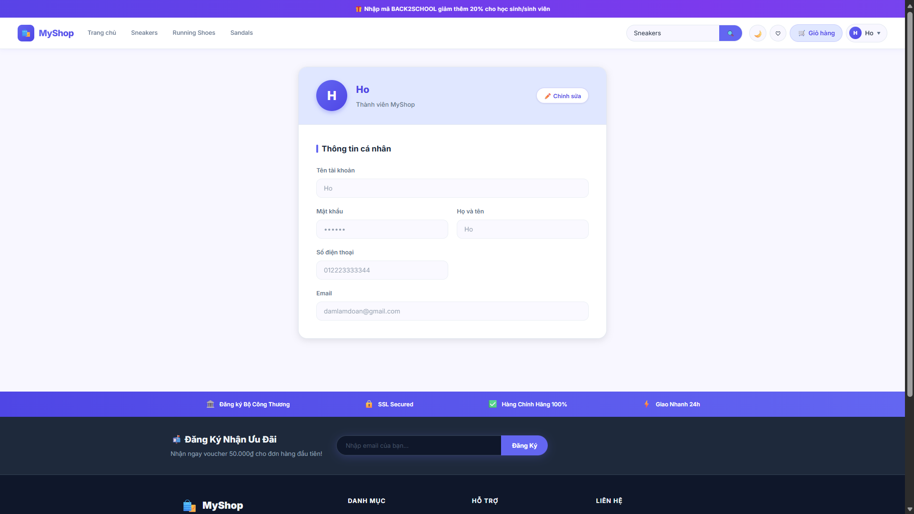

#### Đơn hàng của khách hàng
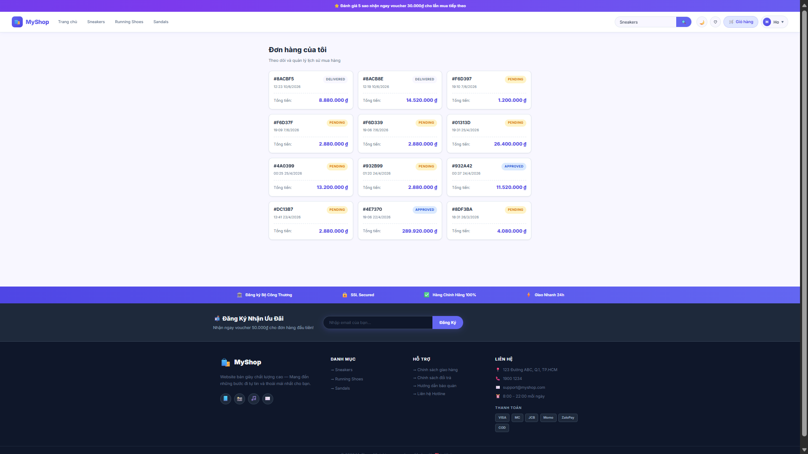

## Cấu trúc thư mục

- `server/`
  - `index.js`: entry point backend
  - `api/`: định nghĩa route API cho `admin` và `customer`
  - `models/`: Data Access Object (DAO) truy vấn MongoDB
  - `utils/`: cấu hình JWT, gửi email, mã hóa, MongoDB
- `client-admin/`: React admin panel
- `client-customer/`: React customer site
- `resources/mongodb/`: dữ liệu mẫu (admins, categories, customers, orders, products)

## Yêu cầu hệ thống

- Node.js 18+ (hoặc Node.js 16+)
- MongoDB (ứng dụng đã cấu hình MongoDB Atlas theo mặc định trong `server/utils/MyConstants.js`)

## Cài đặt và chạy

1. Cài đặt dependencies backend:

```bash
cd server
npm install
```

2. Cài đặt dependencies frontend:

```bash
cd ../client-admin
npm install
cd ../client-customer
npm install
```

3. Build frontend để backend có thể phục vụ:

```bash
cd ../server
npm run build
```

4. Chạy backend:

```bash
npm start
```

5. Truy cập ứng dụng:
- Khách hàng: `http://localhost:3000`
- Admin: `http://localhost:3000/admin`

## Tài khoản mẫu
- Admin:
  - Username: `admin`
  - Password: `123`
- Customer (mẫu):
  - Username: `Ho`
  - Password: `123456`

## API chính

### Backend chung
- `GET /hello`: kiểm tra server
- `GET /admin`: phục vụ admin React app
- `GET /`: phục vụ customer React app

### Admin API
- `POST /api/admin/login`
- `GET /api/admin/token`
- `GET /api/admin/categories`
- `POST /api/admin/categories`
- `PUT /api/admin/categories/:id`
- `DELETE /api/admin/categories/:id`
- `GET /api/admin/products`
- `POST /api/admin/products`
- `PUT /api/admin/products/:id`
- `DELETE /api/admin/products/:id`
- `GET /api/admin/orders`
- `GET /api/admin/orders/customer/:cid`
- `PUT /api/admin/orders/status/:id`
- `GET /api/admin/customers`
- `PUT /api/admin/customers/deactive/:id`
- `GET /api/admin/customers/sendmail/:id`

### Customer API
- `GET /api/customer/categories`
- `GET /api/customer/products/new`
- `GET /api/customer/products/hot`
- `GET /api/customer/products/category/:cid`
- `GET /api/customer/products/search/:keyword`
- `GET /api/customer/products/:id`
- `POST /api/customer/signup`
- `POST /api/customer/forgot-password`
- `POST /api/customer/reset-password`
- `POST /api/customer/active`
- `POST /api/customer/login`
- `GET /api/customer/token`
- `PUT /api/customer/customers/:id`
- `POST /api/customer/checkout`
- `GET /api/customer/orders/customer/:cid`

## Lưu ý bảo mật

- Hiện tại backend đã được cấu hình để sử dụng biến môi trường trong `server/.env`.
- Tạo file `server/.env` từ mẫu `server/.env.example`.
- Sử dụng `DB_USER`, `DB_PASS`, `DB_SERVER`, `DB_DATABASE`, `JWT_SECRET`, `JWT_EXPIRES`, `EMAIL_USER`, `EMAIL_PASS` để bảo mật cấu hình.
